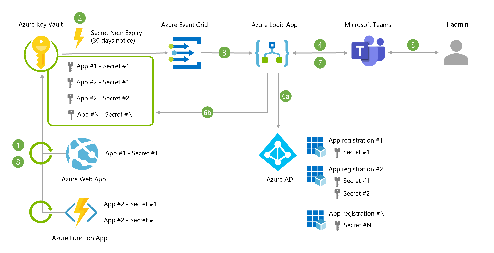
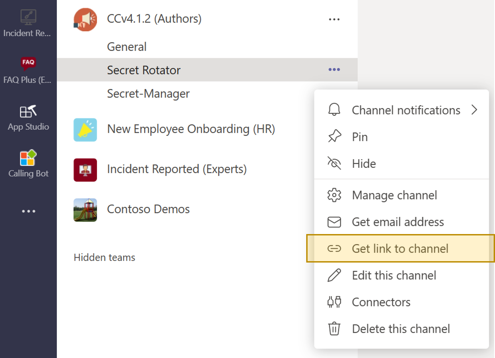
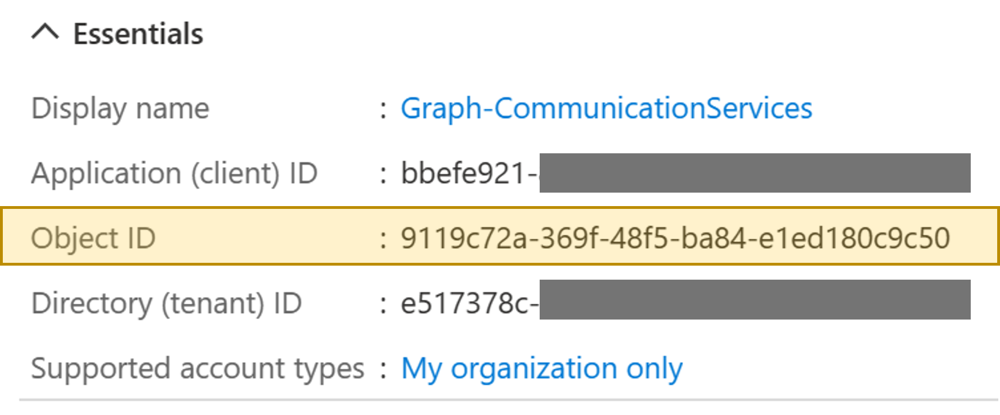
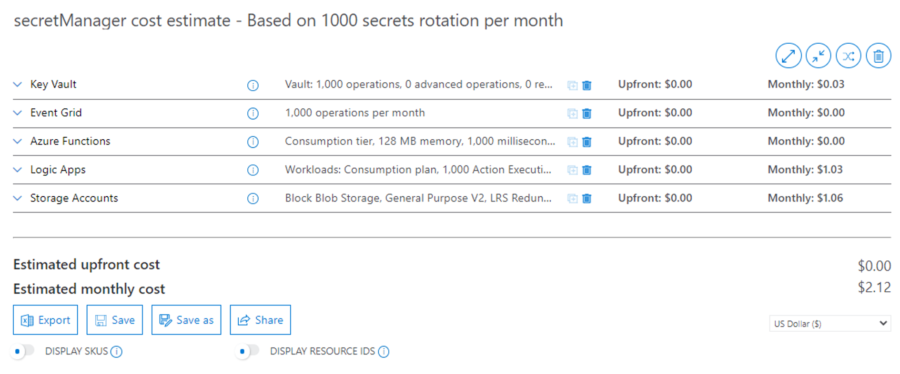

# Azure AD application secret rotator for Azure web sites

## What it is

When deploying an application to Azure, it is very common to register your app in Azure AD and create an application secret. This secret is randomly generated at creation and requires an expiration date with a default value of 6 months. Then everything goes fine until the day when your application secret expires : this will typically break your application with users not being able to authenticate or the app able not being able to call API like Microsoft Graph.

To avoid this situation, you can set a reminder in your Outlook calendar or you could have a system that automatically takes care of the secret rotation before the expiry date comes. This is what you'll find in this repository : AzureAD-AppSecretManager is here to manage the rotation of Azure AD secrets and roll-out the new version to the Azure web sites (Azure webapps and Azure Function apps) that consumme them. 

Here are the key features provided by the solution :
- Watch for Azure AD secret expiry dates using Azure Key Vault
- Notifies users directly into Microsoft Teams to confirm next steps (confirm roll-out / postpone and set a reminder / cancel the operation)
- Automaticaly roll-out the new-secret to Azure web sites 

## Solution overview

### High Level Design



1. Azure Web Apps and Function Apps are configured with [Azure Key Vault references](https://docs.microsoft.com/en-us/azure/app-service/app-service-key-vault-references) to access their secrets via environment variables. 
2. Application secrets in Azure Key Vault are all set with an expiry date aligned with the expiry date in Azure AD. Azure Key Vauly will trigger the event "Secret Near Expiry" **30 days before the expiration date** (note: the 30 days period can't be changed at the moment)
3. This event is relayed to Azure Logic App via Azure Event Grid (topic/subscription) - Azure Logic App will then orchestrate the workflow to renew the secret.
4. Azure Logic App sends an adaptive card into a Microsoft Teams channel to notify an IT admin that a secret will expire - The adaptive card contains a list of all identified web sites that use this secret.
5. From within Microsoft Teams, the IT admin admin can choose to "Confirm" / "Remind me in X days" / "Cancel" the operation. If "Confirm" is selected, the Azure Logic App goes to next steps of the workflow.
6. a. A new app secret is generated with a new expiry date (default : 180 days) - b. A secret version is created in Azure Key Vault (all other versions are disabled)
7. The IT admin is notified for the success / failure of the workflow
8. When newer versions of a secret become available in Azure Key Vault, such as with a rotation event, the web apps will automatically update and begin using the latest version **within one day**. No need to (soft) restart the app (except to force the secret rotation)

Note : this solution can be easily modified to automatically rotate the secret without any human intervention. It can also be modified to add additional steps as part of the workflow.

### Structure of the GitHub repository
<br>

```
AzureAD-AppSecretManager
 | - Deployment           // Contains the ARM template and PShell scripts for deployment
 | | - azuredeploy.json
 | | - parameters.json
 | | - deploy.ps1
 | - Get-AzKVSecretTags   // This function gets the tags associated to a secret in Key Vault
 | | - function.json
 | | - run.ps1
 | - Get-AzWebSites       // This function gets the web sites configured to use a given secret in Key Vault
 | | - function.json
 | | - run.ps1
 | - New-GenerateAppSecret // This function generates a new secret in Azure AD and store it in Key Vault
 | | - function.json
 | | - run.ps1
 | - Update-AzKVSecret    // This function disables all previous version of a given secret
 | | - function.json
 | | - run.ps1
 | - Media                // Contains all the media file of the GitHub documentation
 | - Modules              // Custom PShell modules to validate JSON body sent to the function apps
 | | - JSON-Schemas
 | | | - JSON-Schemas.psd1
 | | | - JSON-Schemas.psm1
 | - .funcignore
 | - .gitignore
 | - CODE_OF_CONDUCT.md
 | - host.json
 | - profile.ps1
 | - proxies.json
 | - README.md
 | - requirements.psd1
 | - SECURITY.md 
 ```

For more info on Azure Functions PowerShell folder structure and development guidelines [click here](https://docs.microsoft.com/en-us/azure/azure-functions/functions-reference-powershell) 

## How to deploy the solution
**Step 1** - Deploy the solution via the Azure portal and provide the required information

[](https://portal.azure.com/#create/Microsoft.Template/uri/https%3A%2F%2Fraw.githubusercontent.com%2Ftimoleo23%2FAzureAD-AppSecretManager%2Fmain%2FDeployment%2Fazuredeploy.json)

__Note__: to get t he 'teamsChannelURL', go to Microsoft Teams and select the channel where the notifications will be sent. From there, cick on "Get link to channel" and paste the value in the Azure portal and ARM template deployment wizard.

<p align="center">
    
</p>

Once your deployment has completed, go to your Azure Logic App in the Azure portal, select "API Connections" and then for each connection do the following :
- Select the connection (named *-EventGrid | *-KeyVault | *-Teams)
- Select 'Edit API Connection'
- Click on 'Authorize' and provide your Azure AD credentials
- Save the modification

Why do you need these steps: the API connections require your consent to perform actions on your behalf. This authorization is only required one time during the deployment.

**Step 2** - Activate the permissions and roles required for your Azure Function MSI

Download the content of this repository and go into the Deployment folder
```bash
git clone https://github.com/timoleo23/AzureAD-AppSecretManager.git
cd AzureAD-AppSecretManager/Deployment
```

Go the the Azure portal to get the ObjectID of the application that needs to have secret rotation enabled
- Go the the [Azure AD app registration](https://portal.azure.com/#blade/Microsoft_AAD_IAM/ActiveDirectoryMenuBlade/RegisteredApps) page
- Select your app that needs secret rotation
- Copy the value of 'Object ID'

<p align="center">
    
</p>

Run the PowerShell script deploy.ps1 with the objectID and name of the Azure resource group where you deployed your resources in Azure (cf. step 1)
```bash
$rgName = "YOUR_RESSOURCE_GROUP_NAME" #MANDATORY
$objectID = "YOUR_AZURE_AD_APP_OBJECT_ID" #MANDATORY
$subscriptionID = "YOUR_AZURE_SUBSCRIPTION_ID" #OPTIONAL - Provide this parameter if you have access to multiple Azure subscriptions with your Azure credentials
$msiObjectId = "YOUR_AZURE_FUNCTION_PRINCIPAL_ID" #OPTIONAL - Provide this parameter in case the script fails to get it from your Azure ARM deployment

./deploy.ps1 -resourceGroupName $rgName -appObjectIdThatNeedsRotation [$objectID -subscriptionID $subscriptionID] [-msiObjectId $msiObjectId]
```

This script performs the following operations:
- Connect to Azure AD and Azure Resource Manager using your Azure AD account
- Give your Azure Function MSI (Managed Service Identity) the rquired permissions to manage apps password rotation in your Azure AD directory
- Set your Azure Function MSI as an owner of the application(s) you want to rotate the secret(s)
- Give your Azure Function MSI the roles of reader and website contributor at the Azure subscription level

**Step 3** - Initialize the system

Now that the service is deployed and permissions are set, we need to synchronize Azure AD with Azure Key Vault. To do that, we'll use the Azure function 'New-GenerateAppSecret' to create a new secret in Azure AD that will be synchronized into Azure Key Vault.

- Go to the Azure Portal - https://portal.azure.com
- Select the Function App deployed in your resource group
- Go to Functions and select the function named 'New-GenerateAppSecret'
- Select 'Code + Test' and then 'Test/Run'
- In the 'Body' section, enter the following JSON - Replace the values
```json
{
  "keyVaultName": "YOUR_KEYVAULT_NAME",
  "objectId": "YOUR_AZURE_AD_APP_OBJECT_ID",
  "secretName": "GIVE_A_NAME_TO_YOUR_APP_SECRET",
  "validityPeriodDays": 180
}
```
Example:
```json
{
  "keyVaultName": "AzKV-secretMan-iaygj",
  "objectId": "9119c72a-369f-48f5-ba84-e1ed180c9c50",
  "secretName": "AzureAD-Application-Secret-1",
  "validityPeriodDays": 180
}
```

- Press RUN

A successful response looks like that :
```json
{
  "Status": "OK",
  "AzKV_secretVersion": "59245db93b67471a838fc87c2038ec6d",
  "AAD_appSecretID": "d43dd1ba-8f86-4168-895c-1def64873dfd"
}
```

**Step 4** - Activate "Azure Key Vault reference" in your app configuration settings

It is a security best practice to store secrets and secure strings in a service like Azure Key Vault - With Azure App Services, application developers can get secrets and secured string via environments variables. But instead of storing these precious data into the application settings of a web app, we'll use Azure Key Vault references to automatically retrieve these secrets at runtime without any code change on the app.

This is the last step of this deployment : making sure that the application settings of your web apps reference the secret sotred in Azure Key Vault. There is a specific syntax to do that that is documented [here](https://docs.microsoft.com/en-us/azure/app-service/app-service-key-vault-references#reference-syntax). 

Based on step 3, you created a new Azure AD app secret that is stored in Azure Key Vault. All you need to do now is to reference this secret in your app configuration.

Let's say that your app gets it's secret from the application setting named "AzureAd:ClientSecret" - Then replace the value of this setting by :
```bash
@Microsoft.KeyVault(VaultName=myvault;SecretName=mysecret)
```
Based on previous example from step 3 it becomes
```bash
@Microsoft.KeyVault(VaultName=AzKV-secretMan-iaygj;SecretName=AzureAD-Application-Secret-1)
```

## Costs
(only provided as an example, as of August-2021 public prices)

The solution is made of consumption based and serverless services - Costs are mainly driven by the number of times a secret needs rotation in a month. This estimate is based on 1,000 password rotation in a month and a deployment in the East US region.



Based on this design and above monthly usage, the estimated monthly costs is **~$2.12 / month**.

You can access the detailed estimate [here](https://azure.com/e/256e361b242b4af1af5e14c2d0adc615) on Azure Pricing Calculator

## Contributing

This project welcomes contributions and suggestions.  Most contributions require you to agree to a
Contributor License Agreement (CLA) declaring that you have the right to, and actually do, grant us
the rights to use your contribution. For details, visit https://cla.opensource.microsoft.com.

When you submit a pull request, a CLA bot will automatically determine whether you need to provide
a CLA and decorate the PR appropriately (e.g., status check, comment). Simply follow the instructions
provided by the bot. You will only need to do this once across all repos using our CLA.

This project has adopted the [Microsoft Open Source Code of Conduct](https://opensource.microsoft.com/codeofconduct/).
For more information see the [Code of Conduct FAQ](https://opensource.microsoft.com/codeofconduct/faq/) or
contact [opencode@microsoft.com](mailto:opencode@microsoft.com) with any additional questions or comments.


## Trademarks

This project may contain trademarks or logos for projects, products, or services. Authorized use of Microsoft
trademarks or logos is subject to and must follow
[Microsoft's Trademark & Brand Guidelines](https://www.microsoft.com/en-us/legal/intellectualproperty/trademarks/usage/general).
Use of Microsoft trademarks or logos in modified versions of this project must not cause confusion or imply Microsoft sponsorship.
Any use of third-party trademarks or logos are subject to those third-party's policies.

## Reference documentation

This documentation helped me a lot in the development of this solution

- [GitHub Azure AD Application Rotator](https://github.com/LockTar/AzureAdApplicationRotator)
- [Automate the rotation of a secret for resources that use one set of authentication credentials](https://docs.microsoft.com/en-us/azure/key-vault/secrets/tutorial-rotation)
- [Managing and Rotating Secrets with Azure Key Vault, Managed Services, and some automation](https://techcommunity.microsoft.com/t5/azure-architecture-blog/managing-and-rotating-secrets-with-azure-key-vault-managed/ba-p/1800612)
- [Handling KeyVault secret rotation changes utilized by an Azure Function](https://docs.microsoft.com/en-us/samples/azure-samples/serverless-keyvault-secret-rotation-handling/handling-keyvault-secret-rotation-changes-utilized-by-an-azure-function/)